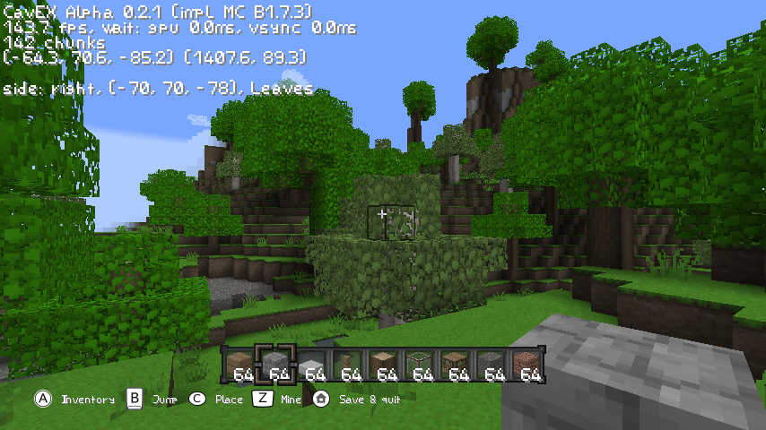

# fCavEX

[Cave Explorer](https://github.com/xtreme8000/CavEX) by [xtreme8000](https://github.com/xtreme8000) is a Wii homebrew game with the goal to recreate most of the core survival aspects up until Beta 1.7.3. ~~Any features beyond *will not* be added.~~

*fCavEX* (forked CavEX) is an experimental fork of CavEX with all kinds of changes and additions. Some additions may not be from the original game and some mechanics may be different - this fork is not aiming for a 1:1 recreation. For now, fCavEX is only tested on a PC - there might be bugs on the Wii.

Unlike CavEX, fCavEX does not aim for complete save compatibility - for instance, chests and signs use an incompatible saving system with static limits and some blocks may use metadata values differently. Until stated otherwise, a freshly created save should be compatible, as fCavEX does not have its own world generator yet.

---

**Features**
* great performance on Wii (about 60fps)
* 5 chunk render distance currently
* load newly created beta world saves
* nearly all blocks added, except redstone related
* many items from the original
* correct light propagation
* ambient occlusion on blocks
* health bar, damage, eating, dying, respawning
* fall damage, lava damage, drowning
* working doors, trapdoors, signs
* compile-time video settings

---

**Planned features** *(in no particular order, not complete)*
* main menu
* generation of new chunks
* biome colors
* ~~player physics~~
* ~~inventory management~~
* ~~block placement~~ and destruction logic
* ~~(random)~~ block updates
* ~~item actions~~
* 2D mobs, fighting
* real texture pack support

## Screenshot


*(from the PC version)*

## Build instructions

You need to download these libraries yourself and place their source files to the following directories. They are required for any platform.

| library | files | destination |
| --- | --- | --- |
| [LodePNG](https://github.com/lvandeve/lodepng) | `lodepng.h` and `lodepng.c` | `source/lodepng/` |
| [cglm](https://github.com/recp/cglm) | `include/cglm/` | `source/cglm/` |
| [cNBT](https://github.com/chmod222/cNBT) | `buffer.c`, `buffer.h`, `list.h`, `nbt_loading.c`, `nbt_parsing.c`, `nbt_treeops.c`, `nbt_util.c` and `nbt.h` | `source/cNBT/` |
| [parson](https://github.com/kgabis/parson) | `parson.h` and `parson.c` | `source/parson/` |
| [M*LIB](https://github.com/P-p-H-d/mlib) | any root `*.h` | compiler include path |

### Video settings

Before building, you can change video settings by editing `source/graphics/gfx_settings.h`. For now, video settings are set at compile time, which means the game needs to be recompiled after changing video settings to recognize them. Unless specified otherwise, the settings affect both the PC version and the Wii version.

Currently available video settings:

* GFX_CLOUDS - if this is defined, 3D clouds will be rendered, otherwise clouds will not be rendered.
* GFX_DOUBLESIDED - if this is not defined, blocks with unculled backfaces will not be rendered. This includes blocks like tall grass and sugar cane.
* GFX_FANCY_LIQUIDS - if this is defined, liquids are transparent and animated. Otherwise, liquids are opaque and not animated, which can noticeably improve performance on low-end GPUs. Disabling this will also make underwater blocks render only if a player is underwater.
* GFX_GUI_SCALE - the game interface is scaled by the value of this define - the greater the value, the larger the interface. This must be set to an integer which isn't lower than 1. The default value of 2 is recommended for the resolution of 640x480. For 320x240, setting this to 1 is recommended. Running the game at a low resolution can greatly improve performance on low-end GPUs.
* GFX_PC_WINDOW_WIDTH and GFX_PC_WINDOW_HEIGHT - this is used to set the default window size on PC and ignored on the Wii.
* GFX_WIREFRAME - if this is defined, polygons on PC will be rendered as wireframes. Enabling this breaks text and texture rendering and may lower performance - this is only included for testing purposes and disabled by default.

### Wii

For the Wii platform you need to install the [devkitPro](https://devkitpro.org/wiki/Getting_Started) Wii/Gamecube environment. Additionally install zlib using pacman of devkitPro.

```bash
dkp-pacman -S wii-dev ppc-zlib
```

To build, simply run make in the root directory. You might need to load the cross compiler env first (required e.g. if you use [fish](https://fishshell.com/) instead of bash).

```bash
source /etc/profile.d/devkit-env.sh
make
```

There should then be a .dol file in the root directory that your Wii can run. To copy the game to your `apps/` folder, it needs to look like this:
```
cavex
├── assets
│   ├── terrain.png
│   ├── items.png
│   ├── anim.png
│   ├── default.png
│   ├── gui.png
│   └── gui2.png
├── saves
│   ├── world
│   └── ...
├── boot.dol
├── config.json
├── icon.png
└── meta.xml
```

### GNU/Linux

The game can also run on any PC with support for OpenGL 2.0 and played with keyboard and mouse.

Building requires the following additional libraries, which you can install with your system package manager: `zlib`, `glfw3` and `glew`. You can then use CMake and gcc to build. The already existing Makefile is for the Wii platform only and might be removed sometime later.

```bash
mkdir build_pc
cd build_pc
cmake ..
make
```

Please also copy the fragment and vertex shaders from `resources/` next to your `assets/` directory.
